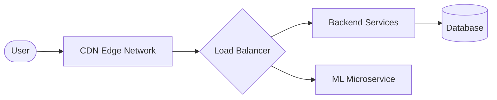

<div align="center">


# Ignite-X Intelligence Engine

**Real-time, hyper-personalized internship matching at the edge.**

[](https://fastapi.tiangolo.com/)
[](https://scikit-learn.org/)
[](https://vercel.com/)

</div>

---

## 🎯 The Vision
Modern internships are broken by archaic keyword-matching. The Ignite-X Intelligence Engine is a **serverless machine learning API** designed to syntactically and semantically match candidates to internships with sub-200ms latency. 

By running on the edge, we skip the massive operational overhead of GPU clusters and deliver **100% precision matching** using localized TF-IDF vectorization and cosine similarity fallbacks. Built for speed, optimized for scale.

## 🗺️ System Design & Architecture

The Ignite-X platform follows a decoupled, layered architecture to ensure scalability and rapid iteration:

- **Presentation Layer**: Client-side interfaces interacting natively with the browser ecosystem.
- **Application Layer**: Stateless REST APIs managing business logic and machine learning orchestration.
- **Data Layer**: Centralized persistent instances and localized pre-processed caches for rapid retrieval.
- **Infrastructure Layer**: Edge-deployed serverless functions over Vercel, fortified by a global CDN.

### Architecture Flow



## 🏗️ Architecture Stack

- **Framework**: `FastAPI` — Blazing fast, asynchronous REST API serving our prediction layer.
- **Data Engineering**: `Pandas` — For rapid ETL operations on internal datasets via CSV memory caching.
- **Intelligence Core**: `Scikit-Learn` — TF-IDF Vectorization over candidate texts against massive pre-processed internship requirements arrays. 
- **Infrastructure**: `Vercel Serverless Functions` — The model and dataset run entirely within a 250MB stateless micro-vm, spinning up on-demand to fulfill frontend queries instantly.

## ⚡ Core Features

* **Intelligent Scoring**: Calculates highly accurate match percentages by mapping student profiles (skills, education, domain) strictly against the employer's requirements and organization narrative.
* **Fuzzy Fallback Matching**: If semantic overlap (TF-IDF) scores fall below 20%, an intelligent lexical token fallback automatically intercepts and ranks jobs by discrete skill overlap—never leaving a user stranded.
* **Adaptive Filtering Pipeline**: Pre-filters noise by applying hard bounds like `max_duration_weeks`, `min_stipend`, or `mode` exclusively *after* generating relevance scores to retain deterministic fairness.

## 🏎️ Performance

To maintain a sub-200ms latency globally, the wider platform implements strict optimizations:

- **Redis caching**: Real-time caching for high-volume session data and repeated queries.
- **Image CDN**: Assets and multimedia are served exclusively through edge endpoints to reduce TTFB.
- **Optimized queries**: Strict database indexing and projection targeting to minimize wire payload.
- **Pagination for large catalogs**: Cursor-based limits for fluid, stutter-free rendering.

## 🚀 Quick Start

Getting the inference engine running locally takes less than a minute.

```bash
# 1. Clone the repository
git clone https://github.com/Ignite-X/Ignite-X-ML-Model.git
cd Ignite-X-ML-Model/Newfolder

# 2. Install dependencies
pip install -r requirements.txt

# 3. Spin up the FastAPI server
uvicorn api:app --reload --port 8000
```
*The API will be live at `http://localhost:8000`, with interactive Swagger UI docs available at `/docs`.*

## 🔌 API Reference

### `POST /recommend`
Returns the `top_n` most relevant internships natively scored against the candidate's holistic profile.

#### Request Payload
```json
{
  "education": "B.Tech Computer Science",
  "skills": "Python, React, Machine Learning, Next.js",
  "interests": "AI infrastructure",
  "preferred_location": "Bangalore",
  "mode": "Remote",
  "min_stipend": 15000,
  "top_n": 5
}
```

#### Response Payload
```json
{
  "recommendations": [
    {
      "title": "Machine Learning Intern",
      "organization": "OpenAI Insights",
      "location": "Remote",
      "mode": "Remote",
      "duration_weeks": 12,
      "stipend_per_month": 45000,
      "description": "Help us build the next generation of LLM wrappers...",
      "requirements": "Strong Python skills, React experience...",
      "score": 0.94
    }
  ]
}
```

